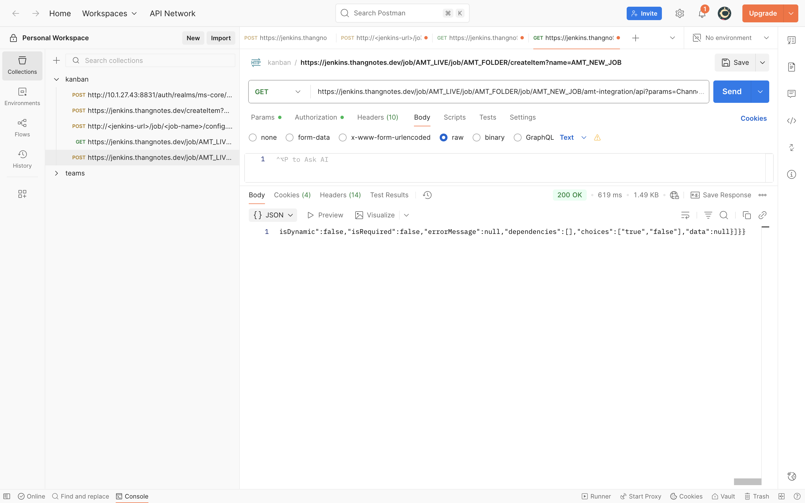
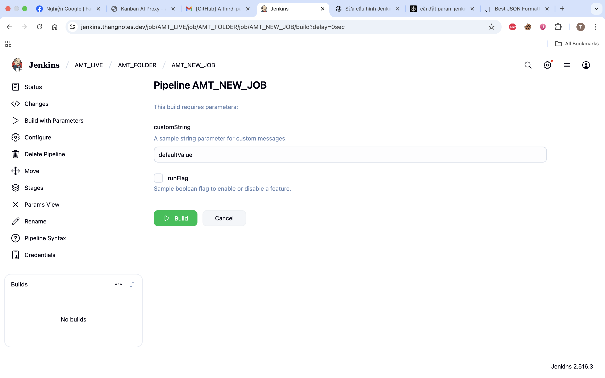
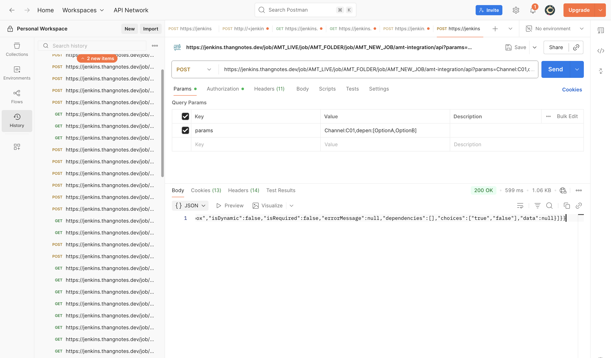

# AMT integration - Jenkins Plugin để lấy thông tin Parameters
## ✨ Tính năng chính

- ✅ **100% chính xác** - Kết quả giống hệt Jenkins UI "Build with Parameters"
- ✅ **Hỗ trợ đầy đủ** - Tất cả loại parameters (built-in và Active Choices)
- ✅ **Cascade parameters** - Xử lý đúng parameters phụ thuộc vào nhau


## 🚀 Cài đặt

1. Vào Jenkins UI: **Manage Jenkins** > **Manage Plugins** > **Advanced**
2. Upload file `amt-integration.hpi`
3. Restart Jenkins

## 📖 Sử dụng

### Job API Endpoint (Khuyến nghị - v1.0.3+)

API hỗ trợ cả **GET** và **POST** methods để lấy thông tin parameters:

#### GET Method
```bash
GET {JENKINS_URL}/job/{JOB_NAME}/amt-integration/api?params=param1:value1,param2:value2
```

#### POST Method (Recommended for production)
```bash
POST {JENKINS_URL}/job/{JOB_NAME}/amt-integration/api
Content-Type: application/json

{
  "params": {
    "param1": "value1",
    "param2": "value2"
  }
}
```

**Ví dụ GET:**
```bash
# Lấy parameters của job AMT_param với Channel=C01
curl "https://jenkins.thangnotes.dev/job/AMT_LIVE/job/AMT_FOLDER/job/AMT_NEW_JOB/amt-integration/api?params=Channel:C01,depen:[OptionA,OptionB]"

# trong đó params là giá trị mà người dùng đã nhập trên màn hình AMT nó dùng làm điều kiện để ẩn hiện các param khác nếu có 
```markdown
# AMT integration - Jenkins Plugin để lấy thông tin Parameters (Tiếng Việt)

Plugin này cung cấp API để truy vấn metadata và giá trị hiện tại của các parameter trong một Job trên Jenkins. Hỗ trợ đầy đủ các loại parameter (String, Boolean, Choice, Active Choices, Cascade/Dependent, Dynamic Reference, ...), và xử lý đúng các dependency giữa các parameter.

## ✨ Tính năng chính

- Kết quả giống hệt màn hình "Build with Parameters" của Jenkins
- Dùng Jenkins API chính thức (không parse bằng regex)
- Hỗ trợ Active Choices plugin và các parameter động
- Xử lý cascade/dependency giữa các parameter

## 🚀 Cài đặt

1. Vào Jenkins UI: Manage Jenkins > Manage Plugins > Advanced
2. Upload file `amt-integration.hpi` (từ thư mục `target/` hoặc file cung cấp)
3. Khởi động lại Jenkins nếu cần

## 🔗 Endpoint chính

API nằm tại:

{JENKINS_URL}/job/{JOB_PATH}/amt-integration/api

Ghi chú: với job nằm trong folder, `{JOB_PATH}` sẽ là chuỗi `job/FolderName/job/SubJob/...` (ví dụ: `job/MyFolder/job/MyJob`).

API hỗ trợ cả GET và POST. POST được khuyến nghị cho production (không giới hạn độ dài URL, an toàn hơn).

## 📥 Request formats (Input)

1) GET (đơn giản, dùng querystring)

  GET /job/.../amt-integration/api?params=key1:val1,key2:val2

  - `params` là chuỗi định dạng `key:value` ngăn cách bằng dấu phẩy. Dùng cho testing nhanh.

2) POST (JSON) - Recommended

  Content-Type: application/json

  a) Object format (khuyến nghị):

  {
    "params": {
      "Channel": "C01",
      "depen": "[OptionB,OptionA]"
    }
  }

  b) String format (hỗ trợ legacy):

  {
    "params": "Channel:C01,depen:[OptionB,OptionA]"
  }

Ghi chú về giá trị array: plugin chấp nhận danh sách dưới dạng chuỗi có bracket (ví dụ: "[A,B]") hoặc giá trị riêng tùy loại input. Đối với multi-select, truyền mảng dưới dạng chuỗi như ví dụ ở trên.

## 📤 Response format (Output)

API trả về JSON có cấu trúc sau (tóm tắt):

{
  "success": true|false,
  "message": "... (nếu có lỗi)",
  "data": {
    "jobName": "...",
    "jobFullName": "...",
    "jobUrl": "...",
    "buildWithParametersUrl": "...",
    "activeChoicesPluginAvailable": true|false,
    "activeChoicesPluginVersion": "x.y.z" | null,
    "parameters": [
      {
        "name": "Channel",
        "type": "ChoiceParameter",
        "description": "...",
        "currentValue": "C01" | ["A","B"],
        "inputType": "select|text|checkbox|dynamic_reference",
        "isDynamic": true|false,
        "isRequired": true|false,
        "errorMessage": null | "...",
        "dependencies": ["otherParam"],
        "choices": ["opt1","opt2"],
        "data": null | "html/snippet"
      },
      ...
    ]
  }
}

Mỗi phần tử `parameters` mô tả metadata của parameter (tên, loại, mô tả), `currentValue` là giá trị hiện tại (nếu có), `choices` là danh sách tùy chọn (với Choice/Cascade), `dependencies` liệt kê các parameter mà tham số này phụ thuộc.

## 🔎 Ví dụ thực tế

Sau đây là các ví dụ cụ thể để bạn thử nhanh bằng curl. Thay `JENKINS_URL` và đường dẫn job bằng môi trường thực tế của bạn.

Lưu ý: nếu Jenkins bật CSRF protection, cần gửi crumb header hoặc dùng Basic auth/token.

1) Lấy tất cả parameters (không truyền current values)

```bash
curl "https://jenkins.example.com/job/AMT_param/amt-integration/api"
```

2) Lấy parameters với một giá trị hiện tại (GET)

```bash
curl "https://jenkins.thangnotes.dev/job/AMT_LIVE/job/AMT_FOLDER/job/AMT_NEW_JOB/amt-integration/api?params=Channel:C01,depen:[OptionA,OptionB]"
```

3) Lấy parameters (POST) — object format (recommended)

```bash
curl -X POST "https://jenkins.thangnotes.dev/job/AMT_LIVE/job/AMT_FOLDER/job/AMT_NEW_JOB/amt-integration/api" \
  -H "Content-Type: application/json" \
  -d '{
    "params": {
      "Channel": "C01",
      "depen": "[OptionB,OptionA]"
    }
  }'
```

4) Lấy parameters cho job trong folder

```bash
curl "https://jenkins.example.com/job/MyFolder/job/MyJob/amt-integration/api?params=env:prod"
```

5) Ví dụ với Boolean / String / Multi-select

POST body (object format):

{
  "params": {
    "customString": "hello world",
    "runFlag": "true",
    "depen": "[OptionA,OptionC]"
  }
}

6) Ví dụ với Dynamic Reference / Active Choices

Active Choices hoặc Dynamic Reference thường phụ thuộc vào giá trị của tham số khác. Ví dụ: `depen` phụ thuộc vào `Channel`. Để mô phỏng, truyền `Channel` trong request — plugin sẽ tính toán giá trị `depen` dựa trên logic của job.

```bash
curl -X POST "https://jenkins.example.com/job/AMT_param/amt-integration/api" \
  -H "Content-Type: application/json" \
  -d '{"params": {"Channel": "C02"}}'
```

## ✅ Trường hợp trả về và cách xử lý

- success = true: `data.parameters` chứa danh sách parameter.
- success = false: đọc `message` để biết lỗi (ví dụ: job không tồn tại, permission, hoặc lỗi khi chạy script của Active Choices).

Edge cases:
- Nếu Active Choices script lỗi => parameter sẽ có `errorMessage` mô tả lỗi.
- Nếu không có quyền truy cập job => HTTP 403 (hoặc success=false với message thích hợp).
- Nếu truyền giá trị không hợp lệ cho multi-select => server cố gắng parse; có thể trả lỗi trong `errorMessage`.

## 🔐 Xác thực và CSRF

1) Basic auth / API token: dùng header Authorization: Basic hoặc công cụ curl `-u user:APITOKEN`.
2) CSRF (Crumb): nếu Jenkins bật CSRF protection, lấy crumb trước rồi gửi header `Jenkins-Crumb: <crumb>` hoặc dùng session đã login.

Ví dụ curl với Basic auth:

```bash
curl -u "username:APITOKEN" -X POST "https://jenkins.example.com/job/AMT_param/amt-integration/api" \
  -H "Content-Type: application/json" \
  -d '{"params": {"Channel": "C01"}}'
```

## Khuyến nghị khi tích hợp

- Dùng POST + Object format cho production.
- Thực hiện retry/backoff nếu Active Choices phụ thuộc vào dịch vụ bên ngoài (network). Plugin có thể trả lỗi tạm thời.
- Kiểm tra `activeChoicesPluginAvailable` để biết liệu job có dùng Active Choices hay không.

## Ví dụ response mẫu (rút gọn)

```json
{
  "success": true,
  "data": {
    "jobName": "AMT_NEW_JOB",
    "jobFullName": "AMT_LIVE/AMT_FOLDER/AMT_NEW_JOB",
    "jobUrl": "job/AMT_LIVE/job/AMT_FOLDER/job/AMT_NEW_JOB/",
    "buildWithParametersUrl": "job/AMT_LIVE/job/AMT_FOLDER/job/AMT_NEW_JOB/buildWithParameters",
    "activeChoicesPluginAvailable": true,
    "activeChoicesPluginVersion": "2.8.8",
    "parameters": [
      {
        "name": "Channel",
        "type": "ChoiceParameter",
        "currentValue": "C01",
        "inputType": "select",
        "isDynamic": true,
        "dependencies": [],
        "choices": ["C01","C02"]
      },
      {
        "name": "depen",
        "type": "CascadeChoiceParameter",
        "currentValue": ["OptionB","OptionA"],
        "inputType": "select",
        "isDynamic": true,
        "dependencies": ["Channel"],
        "choices": ["OptionA","OptionB"]
      }
    ]
  }
}
```

---




```


## Khi không có Active Choices

Nếu Jenkins server không sử dụng plugin Active Choices (tức là không có parameter động do plugin này tạo), AMT-integration sẽ trả về các parameter mặc định (tĩnh) do Jenkins cung cấp. Trong trường hợp này trường `activeChoicesPluginAvailable` sẽ là `false` và `activeChoicesPluginVersion` là `null`.

Ví dụ (GET):

URL: https://jenkins.thangnotes.dev/job/AMT_LIVE/job/AMT_FOLDER/job/AMT_NEW_JOB/amt-integration/api?params=Channel:C01,depen:[OptionA,OptionB]

Ví dụ response:

```json
{"success":true,"data":{"jobName":"AMT_NEW_JOB","jobFullName":"AMT_LIVE/AMT_FOLDER/AMT_NEW_JOB","jobUrl":"job/AMT_LIVE/job/AMT_FOLDER/job/AMT_NEW_JOB/","buildWithParametersUrl":"job/AMT_LIVE/job/AMT_FOLDER/job/AMT_NEW_JOB/buildWithParameters","activeChoicesPluginAvailable":false,"activeChoicesPluginVersion":null,"parameters":[{"name":"customString","type":"StringParameterDefinition","description":"A sample string parameter for custom messages.","currentValue":"defaultValue","inputType":"text","isDynamic":false,"isRequired":false,"errorMessage":null,"dependencies":[],"choices":[],"data":null},{"name":"runFlag","type":"BooleanParameterDefinition","description":"Sample boolean flag to enable or disable a feature.","currentValue":"false","inputType":"checkbox","isDynamic":false,"isRequired":false,"errorMessage":null,"dependencies":[],"choices":["true","false"],"data":null}]}}
```

Trong ví dụ trên, danh sách `parameters` chỉ còn hai tham số tĩnh: `customString` và `runFlag`.






